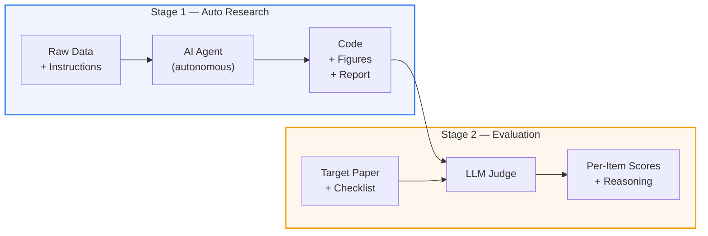
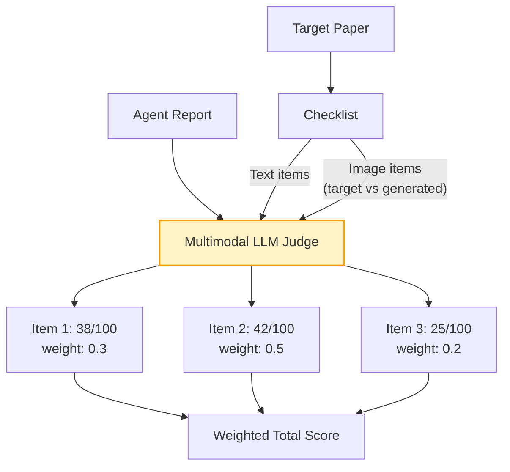

<div align="center">
  <h1>ResearchClawBench</h1>
</div>

<div align="center">

[](https://InternScience.github.io/ResearchClawBench-Home/)&#160;
[](https://github.com/InternScience/ResearchClawBench)&#160;
[](LICENSE)
[](https://www.python.org/)
[](#-10-scientific-domains)
[](#-10-scientific-domains)
[](https://github.com/InternScience/ResearchClawBench)

**Evaluating AI Agents for Automated Research from Re-Discovery to New-Discovery**


[Quick Start](#-quick-start) | [How It Works](#%EF%B8%8F-how-it-works) | [Domains](#-10-scientific-domains) | [Leaderboard](#-leaderboard) | [Add Your Agent](#-add-your-own-agent)

</div>

<p align="center">
  
</p>

---

ResearchClawBench is a benchmark that measures whether AI coding agents can **independently conduct scientific research** — from reading raw data to producing publication-quality reports — and then rigorously evaluates the results against **real human-authored papers**.

Unlike benchmarks that test coding ability or factual recall, ResearchClawBench asks: *given the same data and tools a human researcher had, can an AI agent arrive at the same (or better) scientific conclusions?*

## ✨ Highlights

<table>
<tr>
<td align="center" width="25%">🔄<br/><b>Two-Stage Pipeline</b><br/><sub>Autonomous research + rigorous peer-review-style evaluation</sub></td>
<td align="center" width="25%">🧪<br/><b>40 Real-Science Tasks</b><br/><sub>10 disciplines, complete datasets from published papers</sub></td>
<td align="center" width="25%">👁️<br/><b>Multimodal LLM Judge</b><br/><sub>Weighted checklist with text & image criteria</sub></td>
<td align="center" width="25%">🤖<br/><b>Multi-Agent Support</b><br/><sub>Claude Code, Codex CLI, OpenClaw & custom agents</sub></td>
</tr>
<tr>
<td align="center">🚀<br/><b>Re-Discovery to New Discovery</b><br/><sub>50 = match the paper, 70+ = surpass it</sub></td>
<td align="center">📋<br/><b>Fine-Grained Checklist</b><br/><sub>Per-item keywords, weights & reasoning</sub></td>
<td align="center">📡<br/><b>Live Streaming UI</b><br/><sub>Watch agents code, plot & write in real-time</sub></td>
<td align="center">🍃<br/><b>Lightweight Dependencies</b><br/><sub>Pure Flask + vanilla JS, no heavy frameworks</sub></td>
</tr>
</table>

## 🎬 Demo

https://github.com/user-attachments/assets/07c427bb-b841-4170-b58f-9b86f1a01264

---

## 💡 Why ResearchClawBench?

Most AI benchmarks evaluate what models **know**. We evaluate what agents can **do**.

- **Real science, not toy problems.** 40 tasks sourced from published papers across 10 disciplines, each with complete experimental datasets.
- **Two-stage pipeline.** Autonomous research first, rigorous evaluation second — just like peer review.
- **Fine-grained, multimodal scoring.** A weighted checklist with text and image criteria, judged by an LLM acting as a strict peer reviewer.
- **Agent-agnostic.** Ships with first-class support for Claude Code, Codex CLI, and OpenClaw. Bring your own agent in one line.
- **From Re-Discovery to New Discovery.** Scoring above 50 means matching the original paper; above 70 means *surpassing* it. The frontier is wide open.

---

## ⚙️ How It Works

ResearchClawBench operates in two distinct stages:



### Stage 1: Autonomous Research

The AI agent receives a workspace containing raw datasets, reference materials, and task instructions. It must independently:

1. **Explore** the data and understand the research question
2. **Write code** to analyze, model, and visualize the data
3. **Produce a research report** (`report/report.md`) with figures, methodology, results, and discussion

No hand-holding. No chain-of-thought hints. The agent works in its own sandboxed workspace with full tool access — just like a real researcher.

<div align="center">

<p><em>Auto Research view — file explorer, live code output, and real-time agent conversation</em></p>
</div>

### Stage 2: Reference-Based Evaluation

Once the agent finishes, its report is evaluated against the **original published paper** using a fine-grained checklist:



Each checklist item includes:
- **Specific criteria** extracted from the paper's key contributions
- **Technical keywords** the judge must verify (e.g., *"ROC-AUC improvement"*, *"Monte Carlo integration"*)
- **Weight** reflecting the item's importance
- **Type** — `text` for methodology/findings, `image` for figure comparison (multimodal vision)

The judge uses a strict rubric where **50 = matching the published paper** and most AI reports score 25–40.

<div align="center">

<p><em>Evaluation view — target paper (left), AI report (center), scored checklist (right)</em></p>
</div>

---

## 🔬 10 Scientific Domains

Each domain contains **4 carefully curated tasks** with complete experimental data from real published research:

| Domain | Example Topics | Data Types |
|:---|:---|:---|
| **Astronomy** | Black hole superradiance, Bayesian stellar inference | `.dat`, `.csv` |
| **Chemistry** | GNN molecular prediction, protein-ligand docking | `.pdb`, `.sdf`, `.csv` |
| **Earth** | Glacier mass balance, climate datasets | `.csv`, multi-region series |
| **Energy** | Battery degradation, renewable energy modeling | `.xlsx`, time series |
| **Information** | NLP benchmarks, deep learning analysis | `.pdf`, `.tex`, `.ipynb` |
| **Life** | Nanopore sequencing, genomic analysis | `.csv`, `.xlsx` |
| **Material** | Materials property prediction, pretrained models | `.pt`, `.csv` |
| **Math** | Multi-agent pathfinding, optimization | `.json`, `.npy`, grid maps |
| **Neuroscience** | Neural decoding, brain signal processing | `.csv`, `.h5`, `.yaml` |
| **Physics** | Quantum geometry, superfluid stiffness | `.h5`, `.json`, `.csv` |

**40 tasks total** — each a self-contained research challenge selected from high-quality human-authored publications, spanning the full spectrum from data analysis to novel scientific insight.

---

## 🚀 Quick Start

### 1. Install

```bash
git clone https://github.com/InternScience/ResearchClawBench.git
cd ResearchClawBench
pip install flask flask-cors python-dotenv structai openpyxl
```

### 2. Configure

Create `evaluation/.env` with your scoring model credentials:

```env
OPENAI_API_KEY=sk-xxx
OPENAI_BASE_URL=https://api.openai.com/v1
SCORER_MODEL=gpt-4o
```

### 3. Launch

```bash
python -m evaluation
```

Open **http://localhost:5000** — browse tasks, pick an agent, hit **Start Run**, and watch the research happen live.

### 4. Score

After a run completes, switch to the **Evaluation** tab and click **Score**. The multimodal LLM judge evaluates each checklist item and returns per-item scores with reasoning.

---

## 🤖 Supported Agents

ResearchClawBench ships with built-in support for three frontier coding agents:

| Agent | Command | Notes |
|:------|:--------|:------|
|  **Claude Code** | `claude --dangerously-skip-permissions -p ...` | Stream-JSON output, auto model detection |
|  **Codex CLI** | `codex exec --full-auto ...` | Full-auto mode |
|  **OpenClaw** | `openclaw agent --agent main ...` | Fully autonomous, 3600s timeout |

### 🔧 Add Your Own Agent

Any command that reads an instruction file and works inside a directory can be used. In the UI, select **Custom** and enter your command using these placeholders:

| Placeholder | Replaced With |
|:---|:---|
| `{prompt_file}` | Absolute path to `INSTRUCTIONS.md` |
| `{workspace}` | Absolute path to the workspace directory |

Example:

```bash
my-agent run --instructions "{prompt_file}" --workdir "{workspace}"
```

Or add it as a preset in `evaluation/config.py`:

```python
AGENT_PRESETS["my_agent"] = {
    "label": "My Agent",
    "icon": "M",
    "logo": "/static/logos/my_agent.svg",
    "cmd": 'my-agent run --instructions "{prompt_file}" --workdir "{workspace}"',
}
```

---

## 📏 Scoring Rubric

The judge follows a strict scientific peer review standard:

| Score | Meaning |
|:------|:--------|
| **0** | Criterion completely absent |
| **1–15** | Mentioned in passing, no real analysis |
| **16–30** | Some work attempted, shallow or with errors |
| **31–45** | Partial attempt, reasonable but incomplete |
| **46–55** | **Matches the published paper** — very rare for AI |
| **56–70** | Matches and adds minor improvements |
| **71–85** | Clearly surpasses the paper |
| **86–100** | Exceptional — far exceeds the original |

> Most AI-generated reports score **25–40**. Reaching 50 means genuinely matching a published paper. The benchmark is intentionally hard.

---

## 🏆 Leaderboard

The built-in dashboard aggregates the best score per (task, agent) pair and displays:

- **Frontier chart** — best score per task across all agents
- **Leaderboard table** — clickable cells linking to individual runs
- **Per-task breakdown** — view any agent's report, code, and score reasoning

The frontier represents the **state of the art** — every point above 50 is uncharted territory where AI surpasses human researchers on that specific task.

---

## 📁 Project Structure

```
ResearchClawBench/
├── evaluation/                 # Core evaluation framework
│   ├── server.py               # Flask API + SSE streaming
│   ├── run_task.py             # Workspace setup + agent subprocess
│   ├── score.py                # Multimodal LLM scoring engine
│   ├── config.py               # Agent presets + constants
│   ├── utils.py                # File tree, path safety, discovery
│   ├── export_static.py        # GitHub Pages static export
│   ├── static/app.js           # Single-file frontend (~1200 LOC)
│   └── templates/index.html    # Entry point
├── tasks/                      # 40 research tasks
│   ├── Astronomy_000/
│   │   ├── task_info.json      # Task description + data manifest
│   │   ├── data/               # Raw experimental datasets
│   │   ├── related_work/       # Reference papers
│   │   └── target_study/       # Paper + checklist + images
│   ├── Chemistry_000/
│   └── ...                     # 10 domains x 4 tasks
└── workspaces/                 # Generated at runtime (gitignored)
```

---

## 🤝 Contributing

We welcome contributions in several forms:

- **New tasks** — Add research challenges in existing or new domains
- **New agents** — Add presets for emerging coding agents
- **Improved rubrics** — Refine scoring criteria and checklist design
- **Bug reports** — Open an issue

---

## 📜 License

[MIT](LICENSE) — use it, fork it, push the frontier.

---

## ⭐ Star History

<a href="https://star-history.com/#InternScience/ResearchClawBench&Date">
 <picture>
   <source media="(prefers-color-scheme: dark)" srcset="https://api.star-history.com/svg?repos=InternScience/ResearchClawBench&type=Date&theme=dark" />
   <source media="(prefers-color-scheme: light)" srcset="https://api.star-history.com/svg?repos=InternScience/ResearchClawBench&type=Date" />
   
 </picture>
</a>
